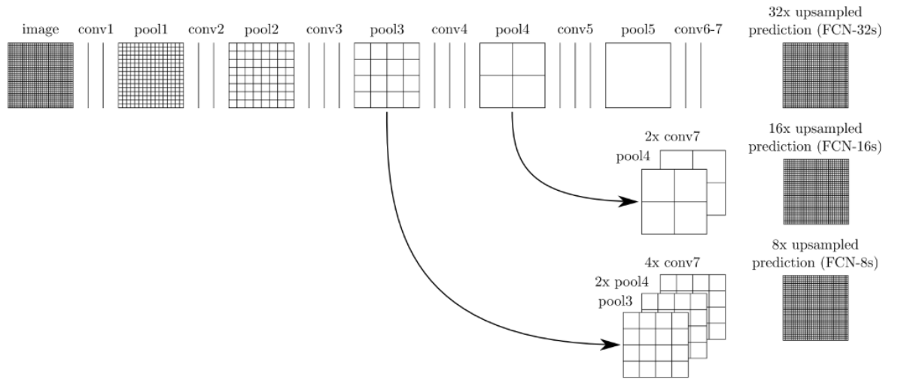
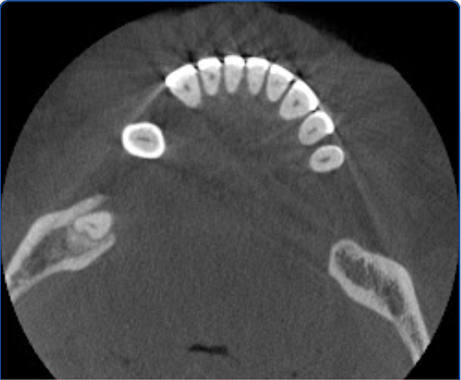
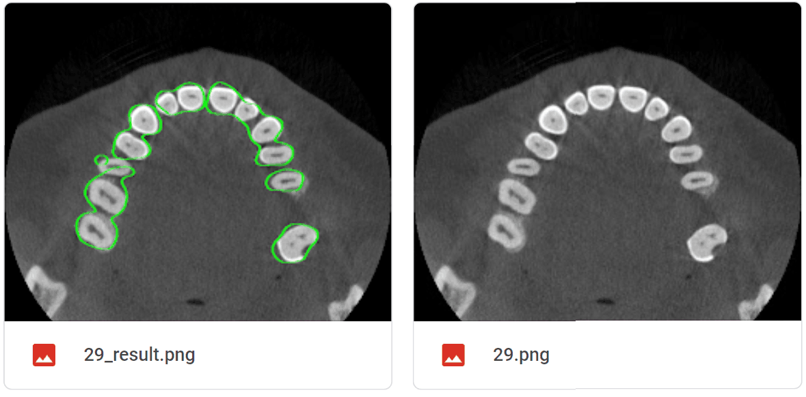
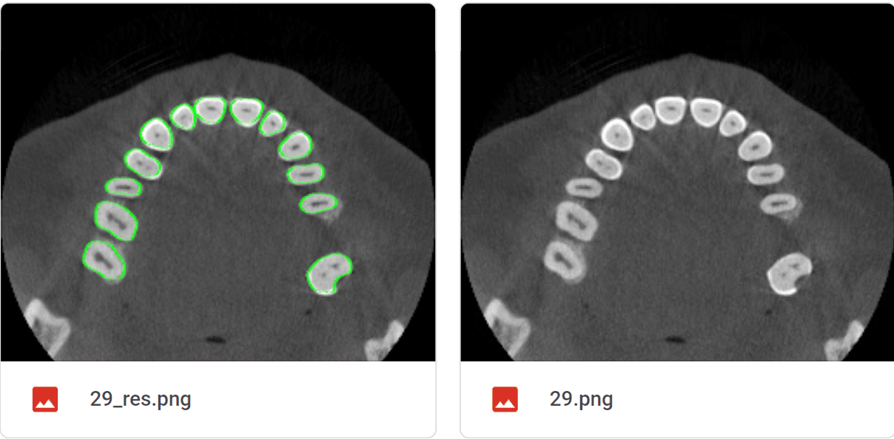

## **pytorch实现FCN语义分割**

### **(一) FCN**
全卷积网络 Fully Convolutional Networks，简称FCN。是语义分割的开山之作。相比于一般的CNN：
1. FCN将全连接层转为卷积层（正是名字的由来）
2. 将下采样得到的特征图进行上采样以信息还原，方法是反卷积
3. 分为FCN-32S,FCN-16S,FCN8S,后两者采用了跳跃连接，其网络结构如下所示
   

### **(二) 一些说明**
1. read_me.md——readme
2. pic——包含read_me所需要的图片
3. mian.ipynb——Jupyter文件，主要包含FCN类定义，数据集处理，网络的训练，测试等
4. 环境：谷歌云Cola (可以白嫖GPU算力)
5. 数据集：本人毕业设计人体口腔CBCT横切位切片，分割目标为牙位区域。原生数据集来自某口腔医院，不公开。其中一名就诊者的一张切片如下所示：
   

### **（三）结果**
1. 可以看到笔者实现的FCN-32S基本实现了对口腔牙位的分割，但是分割效果比较粗糙
2. 笔者还实现了U-Net下的分割（见https://github.com/april0228/UNetLane，不过需要将车道线数据集换成本实验所用数据集）   
   不难看出，U-Net的分割效果比FCN好很多，FCN连相邻的边界区域都无法区分，但是U-Net可以。诸如准确率ACC，交并比IOU也是U-Net数据要好太多。
3. 第一张图为FCN分割结果，第二张为U-Net，二者均是左边是分割结果，右边是原图，绿色为分割边界。
      
   

